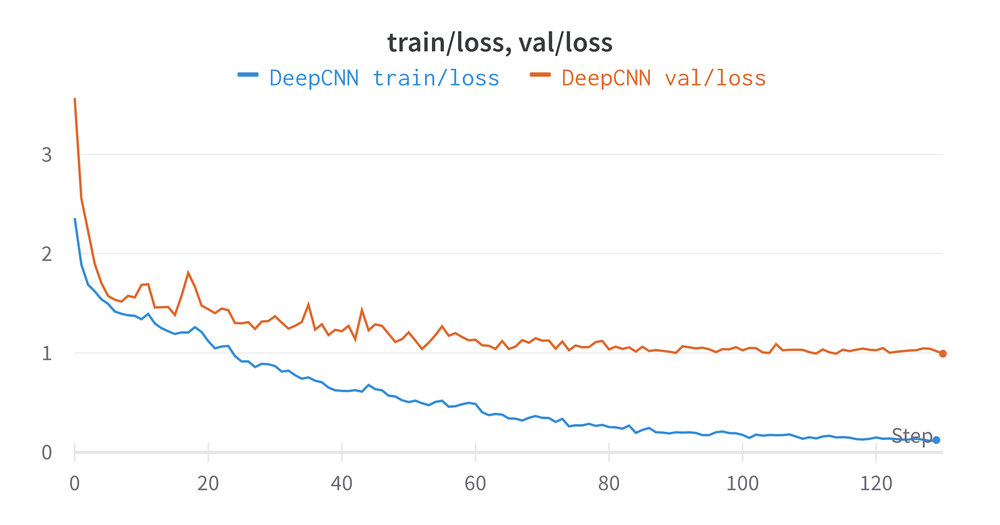
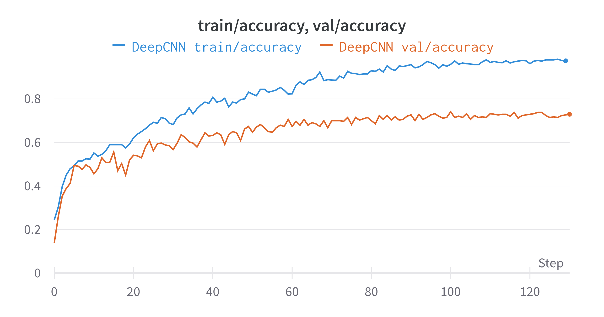
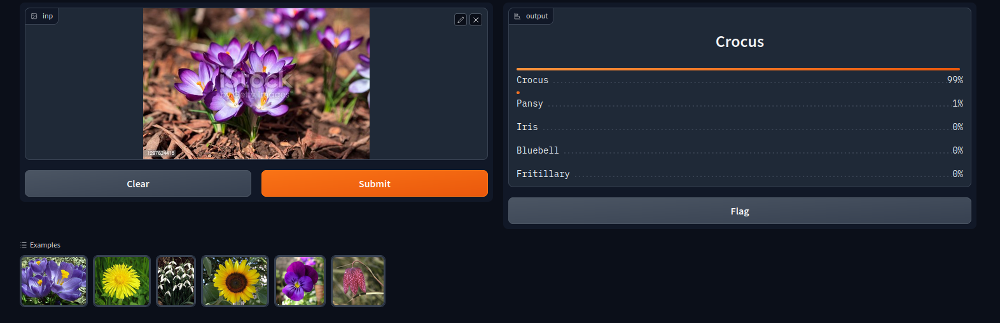

# flowers-classification
Flower species classification using simple Deep Convolutional Neural Network (DeepCNN). DeepCNN is trained with [17 Category Flower Dataset](https://www.robots.ox.ac.uk/~vgg/data/flowers/17/index.html). All experiments are logged to the WandB project which can be found [here](https://wandb.ai/thawro/flowers-classification?workspace=user-thawro)

## Tech stack
* [PyTorch](https://pytorch.org/) - neural networks architectures and datasets classes
* [PyTorch Lightning](https://www.pytorchlightning.ai/index.html) - model training and evaluation
* [plotly](https://plotly.com/) - visualizations
* [WandB](https://docs.wandb.ai/) - metrics, visualizations and model logging
* [torchmetrics](https://torchmetrics.readthedocs.io/en/stable/) - metrics calculation
* [gradio](https://gradio.app/) - application used to show how model works in real world

## Model training 
### Command
```bat
make train_model
```
### Screenshots from wandb
train vs val metrics (loss, accuracy and fscore)




confusion matrix (test set)


example predictions (test set)


## Gradio inference 
### Command
```bat
make gradio_inference
```
### Screenshots from gradio



